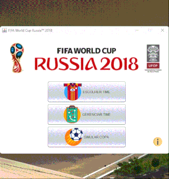

# BCC221 - Object Oriented Programming

The FIFA World Cup Russia 2018 Simulator is an educational project developed for the Object Oriented Programming course [BCC221](http://www3.decom.ufop.br/decom/ensino/disciplina/bcc221/2018-1) at the Universidade Federal de Ouro Preto. The project was implemented in Java using NetBeans as an Integrated Development Environment (IDE). The simulator allows users to choose their favorite national team, create strategies and simulate matches during the FIFA World Cup 2018 in Russia.

Through this project, we applied our knowledge of Object-Oriented Programming, Java, and software development. By simulating football matches and the World Cup, we gained practical experience in designing and implementing complex systems using OOP principles. Additionally, this project has significantly improved our problem-solving skills and creativity in creating interactive applications.


## Demo




## Lessons Learned

Throughout the development of the FIFA World Cup Russia 2018 Simulator, the following Object Oriented Programming principles were applied:

- Encapsulation
  
    Data and methods of inner classes have been encapsulated to hide their implementation details, promoting a clean and organized interface for interacting with objects.

- Abstraction

    Abstraction was used to define clear interfaces for each class, facilitating the understanding and use of the simulator's different components.

- Inheritance 
    
    Inheritance was used to create a hierarchy, such as for Players, allowing us to represent players with shared attributes while retaining individual.

- Polymorphism
    
    Because there are different strategies and game formations, the principle of polymorphism was applied, maintaining a consistent interface.

- Composition
    
    The project was built using compositing to assemble complex objects, such as `Teams` and `Matches`, from smaller, reusable components. This approach facilitated modularity and improved the maintainability of the code.


## Development Tools

The development of the FIFA World Cup Russia 2018 Simulator, we utilized the following tools and technologies:

- Java Programming Language
- NetBeans IDE
- File Handling (for persistence)
- Object-Oriented Design and Principles


## Run Locally

1. Clone the project

    ```bash
      git clone https://github.com/gustavofariaa/TP2_BCC221.git
    ```

1. Open the project in Netbeans.

1. Build and run the app.


## Authors

- ]@gustavofariaa)(https://github.com/gustavofariaa)
- ]@riibeirogabriel)(https://github.com/riibeirogabriel)